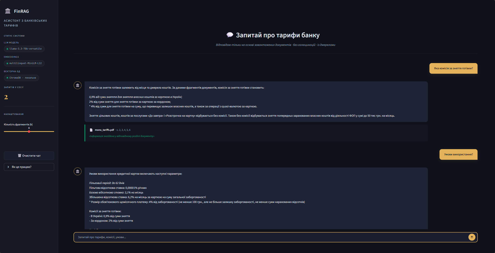

# 🏛️ FinRAG: AI-Асистент з банківських тарифів

[](https://www.python.org/downloads/)
[](https://streamlit.io/)
[](https://python.langchain.com/)
[](https://groq.com/)

Система використовує архітектуру RAG (Retrieval-Augmented Generation), щоб аналізувати офіційні PDF-документи банку та генерувати точні відповіді _без галюцинацій_, базуючись виключно на знайденому контексті. Візуальний інтерфейс побудовано на базі глибоко кастомізованого темного дизайну Streamlit, що імітує преміальні фінтех-продукти.



---

## ✨ Основні можливості

- **Точність (Zero-Hallucination):** Модель відповідає **тільки** якщо знаходить підтвердження у завантажених PDF-документах. Якщо інформації немає в документах, бот чесно про це повідомить.
- **Гібридна стратегія пошуку:** Поєднання семантичного векторного пошуку (через ChromaDB) із жорстким fallback-скануванням фінансових термінів і ключових слів.
- **Блискавична швидкість:** Генерація відповідей відбувається миттєво завдяки API Groq та потужній моделі `llama-3.3-70b-versatile`.
- **Преміальний UI:** Кастомний темний дизайн, золотисті акценти, змінені чат-бульбашки, закріплене та стилізоване бокове меню. Жодних дефолтних артефактів Streamlit.
- **Інтерфейс джерел (Citations):** Кожна відповідь супроводжується інтерактивною карткою з посиланням на офіційний документ (назва файлу та сторінки).

## 🛠 Технологічний стек

* **Frontend:** Streamlit (із "хакерською" стилізацією через ін'єкцію CSS)
* **LLM Інференс:** Llama-3.3-70B-Versatile (через Groq API)
* **Векторна база даних:** ChromaDB (локальна, постійна)
* **Embeddings:** HuggingFace `sentence-transformers/paraphrase-multilingual-MiniLM-L12-v2`
* **Оркестрація:** LangChain
* **Обробка документів:** `pypdf` та `pdfplumber`

## 📂 Структура проєкту

```text
FinRAG/
├── app.py                  # Головний файл UI (Streamlit, інтерфейс та обробка стану)
├── data/                   # Директорія для зберігання вхідних PDF (договори, тарифи)
├── src/                    # Ядро логіки
│   ├── generator.py        # Інтеграція з Groq (спілкування з LLM)
│   ├── retrieval.py        # Багатошарова логіка пошуку (Vectors + Keywords)
│   ├── parser.py           # Обробка та чанкінг PDF-документів
│   └── setup_db.py         # Скрипт первинної індексації та ініціалізації бази ChromaDB
├── requirements.txt        # Список Python-залежностей
├── .env.example            # Приклад конфігураційного файлу (громадський)
└── README.md
```

## 🚀 Встановлення та локальний запуск

### 1. Клонування репозиторію
```bash
git clone https://github.com/fiks9/FinRAG.git
cd FinRAG
```

### 2. Створення віртуального середовища
Для ізоляції бібліотек наполегливо радимо створити віртуальне середовище Python:
```bash
python -m venv venv
# Активація (Windows):
venv\Scripts\activate
# Активація (macOS/Linux):
source venv/bin/activate
```

### 3. Встановлення залежностей
```bash
pip install -r requirements.txt
```

### 4. Налаштування змінних оточення
Проєкту необхідний ключ від [Groq](https://console.groq.com/). 
Зробіть копію файлу `.env.example`, назвіть її `.env` і додайте туди свій токен:
```ini
GROQ_API_KEY="gsk_1234567890abcdef..."
```

### 5. Підготовка бази даних (векторизація)
Покладіть ваші PDF-інструкції та правила банку у теку `data/`. Потім збудуйте базу:
```bash
python src/setup_db.py
```
_(Цей скрипт розділить тексти на чанки, прожене їх через Embedding-модель і надійно збереже у локальну базу ChromaDB)._

### 6. Старт!
Запустіть Streamlit:
```bash
streamlit run app.py
```
Застосунок запуститься у браузері за адресою `http://localhost:8501`.

## 🎨 Дизайн та Архітектура Інтерфейсу

Ми доклали багато зусиль, щоб застосунок не виглядав як типовий "дата-саєнс дашборд", а мав зовнішність комерційного продукту:
- Приховано стандартний Streamlit Header і меню гамбургера.
- Сайдбар примусово закрито від згортання - він залишається "прибитим" зліва, виступаючи пультом управління.
- Інтерактивні "чіпси" (Chip-кнопки) на стартовому екрані для швидкого старту комунікації.
- Ідеально відцентроване (`flex-box`) поле чату без білих артефактів Streamlit BaseWeb UI.

## 🤝 Контрибуція

Усі пулл-реквести й ідеї вітаються. Створюйте **Issue** або робіть **Pull Request**. Під час розробки дотримуйтесь форматування наявного коду.

---
*Розроблено з любов'ю до штучного інтелекту та крутих інтерфейсів.* 🖤
